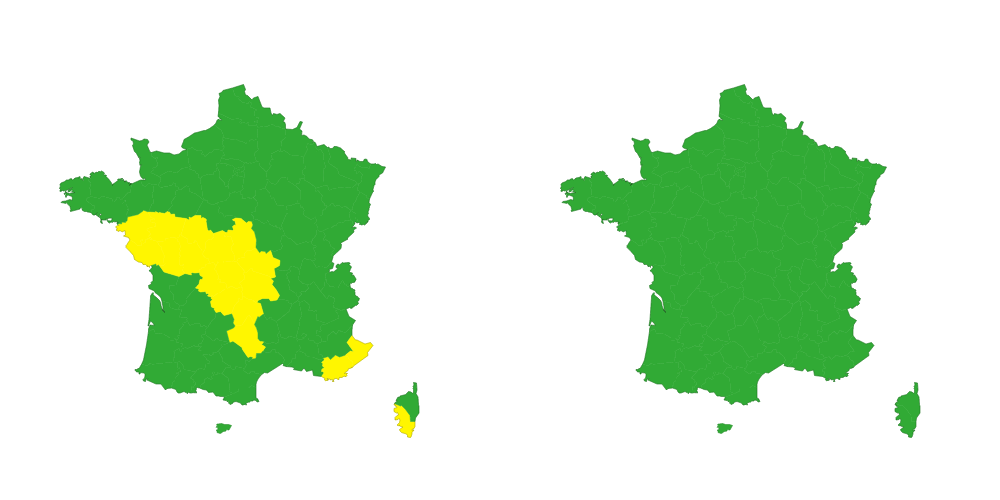

# Projet: Analyse des données géographiques

## Auteurs
- **LECKOMBA Jude Luther**

Ce projet consiste à analyser des données géographiques en utilisant les données de Meteo France pour identifier des personnes situées dans des communes où des alertes météorologiques sont en vigueur.



## Table des matières
1. [Introduction](#introduction)
2. [Prérequis](#prérequis)
3. [Installation](#installation)
4. [Utilisation](#utilisation)
5. [Fonctionnalités](#fonctionnalités)
6. [Contribuer](#contribuer)
7. [Licence](#licence)

## Introduction
L'objectif de cet exercice est de:
- Simuler des points géographiques situés en France.
- Déterminer le département de chaque point simulé.
- Supprimer les points ne se trouvant pas dans un département.
- Associer des alertes météorologiques à chaque point en fonction de son département.
- Créer un DataFrame avec ces informations.
- Produire des graphiques et des visualisations interactives pour afficher les résultats.

## Prérequis
Avant de commencer, assurez-vous d'avoir les éléments suivants installés sur votre machine:
- Python 3.x
- Bibliothèques Python: requirements.txt

## Installation
Clonez ce dépôt GitHub sur votre machine locale en utilisant la commande suivante:
```bash
git clone https://github.com/judeLuther/analyse-donnees-geographiques.git
